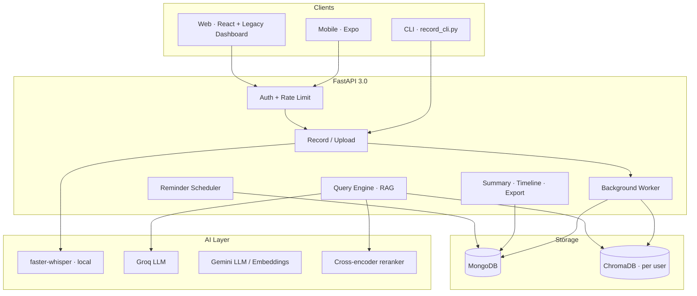

# Verath

<p align="center">
  <strong>AI-Powered Personal Memory System</strong><br>
  Version 3.0.0 · Record · Extract · Search · Remember
</p>

<p align="center">
  <a href="LICENSE"></a>
  <a href="https://www.python.org/downloads/"></a>
  <a href="https://fastapi.tiangolo.com/"></a>
  <a href="https://react.dev/"></a>
  <a href="https://expo.dev/"></a>
</p>

---

## Table of contents

1. [Overview](#overview)
2. [What makes Verath different](#what-makes-verath-different)
3. [Features](#features)
4. [Architecture](#architecture)
5. [Data pipelines](#data-pipelines)
6. [Tech stack](#tech-stack)
7. [Project structure](#project-structure)
8. [Installation & setup](#installation--setup)
9. [Configuration reference](#configuration-reference)
10. [Running the application](#running-the-application)
11. [Clients: Web & Mobile](#clients-web--mobile)
12. [API reference](#api-reference)
13. [Authentication](#authentication)
14. [Memory model & lifecycle](#memory-model--lifecycle)
15. [Background worker & task queue](#background-worker--task-queue)
16. [Testing](#testing)
17. [Docker & deployment](#docker--deployment)
18. [Security](#security)
19. [Performance](#performance)
20. [Troubleshooting](#troubleshooting)
21. [Roadmap](#roadmap)
22. [Contributing](#contributing)
23. [License & acknowledgments](#license--acknowledgments)

---

## Overview

Verath is an intelligent personal memory system. You record voice notes, meetings, or thoughts; the backend transcribes audio, extracts structured metadata (intent, entities, dates, importance), stores everything in **MongoDB** (documents) and **ChromaDB** (vectors), and lets you query your history in natural language using **retrieval-augmented generation (RAG)** with cross-encoder re-ranking.

### Typical user journey

1. **Capture** — Speak into the mobile app, use the web dashboard, hit `POST /record`, or run the CLI.
2. **Process** — Whisper transcribes locally; the memory extractor cleans text, detects corrections, classifies intent, and scores importance.
3. **Store** — Each memory gets a UUID, Gemini embedding, MongoDB document, and ChromaDB vector (per-user collection).
4. **Recall** — Ask “What meetings did I have this week?”; the query engine retrieves 20 candidates, re-ranks to top 5, and Groq/Gemini answers from your data only.
5. **Act** — Reminders fire for dated meetings/deadlines; export or delete memories; view timeline, graph, and insights.

### Who it is for

| Audience | Use case |
|----------|----------|
| Students | Lecture capture and Q&A over course material |
| Professionals | Meeting notes, deadlines, action items |
| Researchers | Idea logging and thematic search |
| Writers | Voice memos retrieved by topic or date |
| Anyone | Searchable, private long-term memory |

---

## What makes Verath different

- **Speech correction handling** — Detects phrases like “meet tomorrow… no, Monday” and uses the corrected meaning.
- **Dual storage** — Full documents in MongoDB; semantic search in ChromaDB with per-user isolation.
- **Grounded answers** — RAG prompts restrict the LLM to retrieved memories; sources and confidence scores are returned.
- **Cross-encoder re-ranking** — Vector search alone is widened to 20 hits, then re-ranked for relevance before the LLM sees context.
- **Resilient vectors** — On startup, missing Chroma collections are rebuilt from MongoDB embeddings.
- **Production-oriented auth** — JWT access + refresh rotation, logout blacklist, rate limits, audit logs.
- **Async processing** — Long recordings can be queued with retries and a dead-letter queue.

---

## Features

### Memory & intelligence (v3.0)

| Feature | Description |
|---------|-------------|
| Speech correction detection | Parses self-corrections in transcripts |
| Intent classification | `meeting`, `deadline`, `task`, `commitment`, `reminder`, etc. |
| Entity extraction | Dates, people, locations, organizations via NLP + `dateparser` |
| Importance scoring | Intent-based boosts for deadlines and meetings |
| Hybrid RAG query | Vector retrieval → cross-encoder re-rank → LLM answer |
| Paginated timeline | Today’s memories with `page` / `page_size` |
| Daily summary & insights | LLM-generated briefings and patterns |
| Memory graph | Nodes and edges for visualization (`GET /graph`) |
| Export | JSON or CSV with optional intent and date filters |
| Delete memory | Removes from MongoDB and ChromaDB atomically |

### Platform & operations

| Feature | Description |
|---------|-------------|
| JWT authentication | Signup, login, refresh rotation, logout blacklist |
| Rate limiting | Signup 5/min, login 10/min, refresh 20/min (per IP) |
| WebSocket | `/ws/updates?token=` for live updates and ping/pong |
| Background worker | Recording jobs, compression, retries (2s → 4s → 8s) |
| Dead-letter queue | Failed tasks inspectable and manually retried |
| Reminder scheduler | APScheduler every 15 minutes |
| Privacy mode | Per-user toggle pauses capture/processing |
| Response caching | Summary, insights, stats, graph (TTL 5–15 min) |
| Health endpoint | MongoDB, ChromaDB, optional Groq status |
| Speaker profiles | Train and list voice labels (optional diarization stack) |

### Audio & input

| Endpoint / tool | Description |
|-----------------|-------------|
| `POST /record` | Server-side microphone capture + pipeline |
| `POST /record/upload` | Mobile multipart audio upload |
| `POST /record/session` | Session-typed recording via background queue |
| `POST /extract` | Text-only extraction without storing |
| `POST /validate` | Noise, length, duplicate checks |
| `scripts/record_cli.py` | Terminal recording utility |

---

## Architecture

### System diagram



### Component responsibilities

| Layer | Path | Role |
|-------|------|------|
| Routes | `backend/app/routes/` | HTTP/WebSocket handlers, auth dependencies |
| Services | `backend/app/services/` | Business logic: store, query, auth, reminders |
| Pipeline | `backend/app/pipeline/` | Audio sessions, extraction, validation |
| Workers | `backend/app/workers/` | Async queue, retries, dead-letter |
| Core | `backend/app/core/` | Logging, cache, validators, exceptions |
| Models | `backend/app/models/` | Pydantic schemas |
| DB | `backend/app/db/` | Memory lifecycle promotion/archival |

### MongoDB collections (typical)

| Collection | Purpose |
|------------|---------|
| `memories` | Full memory documents + embeddings |
| `users` | Hashed credentials |
| `refresh_tokens` | Rotating refresh token store |
| `blacklisted_tokens` | Logged-out JWT `jti` values |
| `audit_logs` | Auth event trail |
| `tasks` / dead-letter | Background job tracking |
| `alerts` | Reminder notifications |

---

## Data pipelines

### Ingestion pipeline (audio → memory)

```
Audio (WAV, 16 kHz mono)
    ↓
faster-whisper (WHISPER_MODEL)
    ↓
Text cleaning (fillers removed)
    ↓
Correction detection
    ↓
Intent + entity extraction
    ↓
Importance scoring + summary (LLM)
    ↓
Gemini embedding (text-embedding-004)
    ↓
MongoDB insert + ChromaDB upsert (per-user collection)
```

### Query pipeline (question → answer)

```
User question
    ↓
Query embedding (same provider as memories)
    ↓
ChromaDB similarity search (top 20 candidates)
    ↓
Metadata filter (intent, min_importance, user_id)
    ↓
Cross-encoder re-ranking (top 5)
    ↓
Context block built for LLM
    ↓
Groq / Gemini generation (grounded prompt)
    ↓
Response: answer + context[] + sources[] + confidence_score
```

Constants in `query_engine.py`: `_N_RETRIEVE = 20`, `_N_FINAL = 5`.

---

## Tech stack

### Backend

| Category | Technology |
|----------|------------|
| Framework | FastAPI, Uvicorn |
| Validation | Pydantic 2.x, pydantic-settings |
| Speech | faster-whisper |
| LLM | Groq (default `llama-3.1-8b-instant`, fallback `llama-3.3-70b-versatile` in queries) |
| Embeddings | Google Gemini `text-embedding-004` |
| Vector DB | ChromaDB 0.5+ (HNSW, cosine) |
| Document DB | MongoDB via Motor (async) |
| Re-ranking | sentence-transformers cross-encoder |
| Scheduler | APScheduler (reminders) |
| Auth | python-jose, bcrypt, slowapi |
| Audio I/O | sounddevice |
| Optional | pyannote.audio (speaker diarization) |

### Web

| Category | Technology |
|----------|------------|
| Auth shell | React 19, Vite 8, Tailwind CSS, Framer Motion |
| Dashboard | Legacy HTML/CSS/JS in `web/legacy/` |
| Icons | Lucide React |

### Mobile

| Category | Technology |
|----------|------------|
| Framework | React Native 0.72, Expo 49 |
| Navigation | React Navigation (bottom tabs) |
| HTTP | Axios |
| Offline | AsyncStorage queue (`offlineQueue.js`) |
| Audio | expo-av |

### Infrastructure

| Tool | Use |
|------|-----|
| Docker | Multi-stage Python 3.11 image |
| docker-compose | MongoDB + backend |
| GitHub Actions | Ruff + pytest + Codecov |
| Makefile | `dev`, `test`, `lint`, `docker`, `migrate` |

---

## Project structure

```
Verath/
├── backend/
│   ├── app/
│   │   ├── main.py                 # FastAPI app, lifespan, /status
│   │   ├── config.py               # Environment settings
│   │   ├── core/                   # cache, exceptions, logging, validators
│   │   ├── db/
│   │   │   └── memory_lifecycle.py # short → long → archived
│   │   ├── models/
│   │   │   ├── memory.py
│   │   │   └── schema.py           # API request/response models
│   │   ├── pipeline/
│   │   │   ├── audio_processor.py
│   │   │   ├── extraction_pipeline.py
│   │   │   └── data_validator.py
│   │   ├── routes/
│   │   │   ├── auth.py             # /auth/*
│   │   │   ├── record.py           # /record, /record/upload
│   │   │   ├── query.py            # /query
│   │   │   ├── advanced.py         # summary, timeline, export, graph
│   │   │   ├── memories.py         # DELETE /memory/{id}
│   │   │   ├── pipeline_routes.py  # /record/session, /extract, /queue/*
│   │   │   ├── reminders.py        # /reminders/*
│   │   │   ├── privacy.py          # /privacy/*
│   │   │   ├── speaker.py
│   │   │   └── websocket.py        # /ws/updates
│   │   ├── services/               # memory_store, query_engine, auth, etc.
│   │   └── workers/
│   │       ├── background_worker.py
│   │       └── task_queue.py
│   ├── tests/                      # pytest suite (12 modules)
│   ├── requirements.txt
│   ├── run.py                      # Dev entry: uvicorn
│   └── pytest.ini
├── web/
│   ├── src/                        # React auth landing
│   │   ├── pages/Auth/AuthLanding.jsx
│   │   ├── components/             # Button, Input, ErrorBoundary
│   │   └── utils/validation.js
│   ├── legacy/                     # Full dashboard (post-login)
│   │   ├── dashboard.html
│   │   ├── app.js, styles.css
│   └── vite.config.js
├── mobile/
│   ├── screens/                    # Home, Ask, Timeline, Settings, Auth
│   ├── components/                 # MicButton, MemoryCard
│   └── services/                   # api.js, auth.js, offlineQueue.js
├── scripts/
│   └── record_cli.py
├── data/                           # chroma_db, uploads (gitignored)
├── .env.example
├── docker-compose.yml
├── Dockerfile
├── Makefile
├── ruff.toml
├── CONTRIBUTING.md
├── LICENSE
└── README.md
```

---

## Installation & setup

### Prerequisites

| Requirement | Notes |
|-------------|-------|
| Python 3.11+ | Backend runtime |
| Node.js 18+ | Web and mobile tooling |
| MongoDB 6.0+ | Local Docker or Atlas |
| FFmpeg | Required for audio (Dockerfile installs it) |
| Groq API key | Recommended for LLM |
| Gemini API key | Recommended for embeddings (and LLM fallback) |

### Step 1 — Clone and environment

```bash
git clone https://github.com/yourusername/Verath.git
cd Verath
cp .env.example .env
```

Generate a secure `SECRET_KEY`:

```bash
python -c "import secrets; print(secrets.token_hex(32))"
```

Minimum `.env` values:

```env
MONGO_URI=mongodb://localhost:27017
DATABASE_NAME=verath
SECRET_KEY=<your-64-char-hex-or-long-random-string>
GROQ_API_KEY=<from console.groq.com>
GEMINI_API_KEY=<from aistudio.google.com>
```

### Step 2 — MongoDB

**Docker (recommended for local dev):**

```bash
docker-compose up -d mongodb
```

**MongoDB Atlas:**

1. Create a free cluster at [mongodb.com/atlas](https://www.mongodb.com/atlas).
2. Whitelist your IP.
3. Copy the connection string into `MONGO_URI`.

### Step 3 — Backend dependencies

```bash
cd backend
python -m venv venv

# Windows PowerShell
.\venv\Scripts\Activate.ps1

# macOS / Linux
source venv/bin/activate

pip install -r requirements.txt
```

Create indexes (optional but recommended):

```bash
cd ..
make migrate
```

### Step 4 — Start backend

```bash
cd backend
python run.py
```

| URL | Purpose |
|-----|---------|
| http://localhost:8000 | API root |
| http://localhost:8000/docs | Swagger UI |
| http://localhost:8000/redoc | ReDoc |
| http://localhost:8000/status | Health check |

### Step 5 — Web client

```bash
cd web
npm install
npm run dev
```

Open http://localhost:5173 — after login you are redirected to `web/legacy/dashboard.html`.

Production build:

```bash
npm run build
npm run preview
```

### Step 6 — Mobile (optional)

Create the mobile environment file:

```bash
cd mobile
cp .env.example .env
```

Set `EXPO_PUBLIC_API_URL` in `mobile/.env` to the backend URL reachable from the target device:

```env
# Android emulator
EXPO_PUBLIC_API_URL=http://10.0.2.2:8000

# iOS simulator or web
# EXPO_PUBLIC_API_URL=http://localhost:8000

# Physical device on the same Wi-Fi
# EXPO_PUBLIC_API_URL=http://YOUR_COMPUTER_IP:8000
```

Restart Expo after changing `.env`.

```bash
npm install
npx expo start
```

### Makefile commands

| Command | Description |
|---------|-------------|
| `make help` | List all targets |
| `make dev` | `uvicorn app.main:app --reload` on port 8000 |
| `make test` | pytest with HTML coverage report |
| `make e2e` | Run `tests/test_e2e.py` |
| `make lint` | Ruff + Black check on `backend/app` |
| `make docker` | `docker-compose up --build` |
| `make migrate` | MongoDB index setup |
| `make clean` | Remove caches and coverage artifacts |

---

## Configuration reference

All settings are loaded from the repo-root `.env` via `backend/app/config.py` (Pydantic Settings).

### Required

| Variable | Description |
|----------|-------------|
| `MONGO_URI` | Must start with `mongodb://` or `mongodb+srv://` |
| `SECRET_KEY` | Min 32 characters; rejects known weak defaults |

### LLM & embeddings

| Variable | Default | Description |
|----------|---------|-------------|
| `GROQ_API_KEY` | — | Groq console API key |
| `GEMINI_API_KEY` | — | Google AI Studio key |
| `LLM_PROVIDER` | `groq` | Primary LLM: `groq` or `gemini` |
| `GROQ_MODEL` | `llama-3.1-8b-instant` | Groq chat model |
| `GEMINI_MODEL` | `gemini-1.5-flash` | Gemini chat model |
| `EMBED_PROVIDER` | `gemini` | Embedding backend |
| `LLM_TIMEOUT` | `30` | Request timeout (seconds) |

### Whisper (local STT)

| Variable | Default | Description |
|----------|---------|-------------|
| `WHISPER_MODEL` | `base` | `tiny` · `base` · `small` · `medium` · `large` |
| `WHISPER_DEVICE` | `cpu` | `cpu` or `cuda` |
| `WHISPER_COMPUTE_TYPE` | `int8` | Quantization for faster-whisper |

| Model | Size (approx.) | Speed | Accuracy |
|-------|----------------|-------|----------|
| tiny | ~70 MB | Fastest | Lowest |
| base | ~140 MB | Balanced | Good (default) |
| small | ~460 MB | Slower | Better |
| medium | ~1.5 GB | Slow | High |
| large | ~3 GB | Slowest | Best |

### Server & security

| Variable | Default | Description |
|----------|---------|-------------|
| `HOST` | `0.0.0.0` | Bind address |
| `PORT` | `8000` | API port (1024–65535) |
| `ENV` | `development` | `production` restricts CORS to `ALLOW_CORS` |
| `ALLOW_CORS` | `*` | Comma-separated origins in production |
| `DEFAULT_RECORD_SECONDS` | `10` | Default mic duration |

### Storage paths

| Variable | Default | Description |
|----------|---------|-------------|
| `VECTOR_DB_PATH` | `data/chroma_db` | Chroma persistence directory |
| `VOICE_DB_PATH` | `data/voices.pkl` | Speaker profile pickle |
| `DATABASE_NAME` | `verath` | MongoDB database name |

### Audio processing

| Variable | Default |
|----------|---------|
| `AUDIO_SAMPLE_RATE` | `16000` |
| `AUDIO_CHANNELS` | `1` |
| `AUDIO_FORMAT` | `int16` |
| `MAX_AUDIO_CHUNK_SIZE` | `30` |
| `SILENCE_THRESHOLD` | `0.01` |
| `MIN_TRANSCRIPTION_LENGTH` | `5` |

### Memory thresholds

| Variable | Default |
|----------|---------|
| `MAX_MEMORY_RESULTS` | `100` |
| `MEMORY_IMPORTANCE_THRESHOLD` | `0.6` |

### Privacy & data flow

- **Whisper** runs on your machine — raw audio is not sent to Groq/Gemini for transcription.
- **LLM and embeddings** call cloud APIs when keys are configured.
- Set `ENV=production` and narrow `ALLOW_CORS` before public deployment.
- Never commit `.env` or API keys.

Full template: [.env.example](.env.example).

---

## Running the application

### Development workflow

```bash
# Terminal 1 — API
make dev

# Terminal 2 — Web
cd web && npm run dev

# Terminal 3 — Mobile (optional)
cd mobile && npx expo start
```

### Always-on listener (optional)

```bash
cd backend
python run_listener.py
```

Runs the voice listener service for continuous capture (see `app/services/listener.py`).

### CLI recording

```bash
python scripts/record_cli.py --duration 15
```

Requires a running backend and valid auth token in environment or config as implemented in the script.

---

## Clients: Web & Mobile

### Web — React auth + legacy dashboard

| Part | Path | Description |
|------|------|-------------|
| Auth landing | `web/src/pages/Auth/AuthLanding.jsx` | Login/signup with validation, Framer Motion UI |
| Validation | `web/src/utils/validation.js` | Username (3–30, alphanumeric `_`) and password rules |
| Dashboard | `web/legacy/dashboard.html` | Stats, timeline, query, insights after auth |
| API base | Auto-detected | `127.0.0.1:8000` on localhost; else hostname:8000 |

Tokens are stored in `localStorage` as `verath_token` and `verath_username`.

### Mobile — Expo app

| Screen | File | Purpose |
|--------|------|---------|
| Login / Register | `LoginScreen.js`, `RegisterScreen.js` | JWT auth |
| Home | `HomeScreen.js` | Stats and neural core status |
| Ask | `AskScreen.js` | Chat-style RAG queries + voice |
| Timeline | `TimelineScreen.js` | Chronological memories |
| Settings | `SettingsScreen.js` | API URL, preferences |
| Tabs | `Tabs.js` | Bottom navigation |

**API configuration:** Mobile API requests use `EXPO_PUBLIC_API_URL` from `mobile/.env`. Start from `mobile/.env.example`; do not edit tracked source files for local backend URLs.

**Offline queue:** Failed API calls are stored in AsyncStorage and retried when the network returns (`mobile/services/offlineQueue.js`).

**Audio upload:** Recordings can be sent via `POST /record/upload` as multipart form data.

---

## API reference

**Base URL:** `http://localhost:8000`

**Auth header (protected routes):**

```http
Authorization: Bearer <access_token>
```

Interactive docs: http://localhost:8000/docs

---

### System

#### `GET /`

```json
{ "message": "Verath API v3.0.0" }
```

#### `GET /status`

Returns service health without authentication.

```json
{
  "status": "running",
  "version": "3.0.0",
  "scheduler": "running",
  "overall": "healthy",
  "nodes": 42,
  "services": {
    "mongodb": "healthy",
    "chromadb": "healthy",
    "groq": "healthy"
  }
}
```

`groq` may be `"not_configured"` when `GROQ_API_KEY` is empty. Overall health requires MongoDB and ChromaDB only.

---

### Authentication (`/auth`)

| Method | Path | Rate limit | Description |
|--------|------|------------|-------------|
| POST | `/auth/signup` | 5/min | Create user |
| POST | `/auth/login` | 10/min | Returns token pair |
| POST | `/auth/refresh` | 20/min | Rotate refresh token |
| POST | `/auth/logout` | — | Blacklist current access token `jti` |

#### Signup

```http
POST /auth/signup
Content-Type: application/json

{
  "username": "alice",
  "password": "securepassword123"
}
```

**201:** `{ "message": "User created successfully", "username": "alice" }`  
**409:** Username already exists

#### Login

```http
POST /auth/login
Content-Type: application/json

{
  "username": "alice",
  "password": "securepassword123"
}
```

**200:**

```json
{
  "access_token": "eyJ...",
  "refresh_token": "eyJ...",
  "username": "alice",
  "token_type": "bearer"
}
```

#### Refresh

```http
POST /auth/refresh
Content-Type: application/json

{ "refresh_token": "eyJ..." }
```

Returns a new access + refresh pair; old refresh token is invalidated.

#### Logout

```http
POST /auth/logout
Authorization: Bearer <access_token>
```

**200:** `{ "message": "Logged out successfully" }`

---

### Recording

#### `POST /record`

Record from server microphone and process immediately.

```http
POST /record
Authorization: Bearer <token>
Content-Type: application/json

{
  "duration": 10,
  "filename": "optional_name.wav"
}
```

**200:**

```json
{
  "success": true,
  "memory": { "id": "uuid", "text": "...", "intent": "meeting", "importance": 0.85 },
  "message": "Audio processed successfully",
  "error": null
}
```

#### `POST /record/upload`

Multipart upload from mobile.

```http
POST /record/upload
Authorization: Bearer <token>
Content-Type: multipart/form-data

file: <audio.wav>
timestamp: <optional ISO string>
```

#### `POST /record/session`

Queue a session-based recording for background processing.

```http
POST /record/session
Content-Type: application/json

{
  "session_type": "meeting",
  "duration": 60,
  "filename": null
}
```

**Session types:** `manual`, `lecture`, `meeting`, `general`, `short`

**200:**

```json
{
  "success": true,
  "task_id": "uuid",
  "session_type": "meeting",
  "message": "Recording queued for processing"
}
```

---

### Query (`GET /query`)

Natural-language search with RAG.

| Parameter | Type | Default | Description |
|-----------|------|---------|-------------|
| `q` | string | required | Question (1–500 chars) |
| `limit` | int | 5 | Final sources after re-rank (1–20) |
| `page` | int | 1 | Pagination page for sources |
| `page_size` | int | 20 | Sources per page (1–100) |
| `intent_filter` | string | null | e.g. `meeting`, `deadline` |
| `min_importance` | float | 0.0 | 0.0–1.0 |

```http
GET /query?q=what%20meetings%20today&limit=5&intent_filter=meeting&min_importance=0.5
Authorization: Bearer <token>
```

**200:**

```json
{
  "answer": "You had a meeting with John at 3pm...",
  "context": ["meeting with John at 3pm..."],
  "sources": [
    {
      "speaker": "John",
      "intent": "meeting",
      "timestamp": "2024-01-15T15:00:00",
      "importance": 0.85,
      "confidence": 0.92
    }
  ],
  "confidence_score": 0.92,
  "pagination": {
    "total": 3,
    "page": 1,
    "page_size": 20,
    "total_pages": 1
  }
}
```

---

### Memories

#### `DELETE /memory/{memory_id}`

Deletes from MongoDB and ChromaDB. Returns **404** if not found, **403** if another user’s memory.

```json
{ "message": "Memory deleted successfully", "id": "uuid" }
```

---

### Analytics & export

| Method | Path | Cache TTL | Description |
|--------|------|-----------|-------------|
| GET | `/summary` | 15 min | Daily LLM summary |
| GET | `/timeline` | — | Today’s events (paginated) |
| GET | `/insights` | 15 min | Pattern insights |
| GET | `/statistics` | 5 min | Counts by intent/speaker |
| GET | `/export` | — | JSON or CSV download |
| GET | `/graph` | 10 min | Nodes + links for viz |
| POST | `/cache/invalidate` | — | Clear user cache |
| GET | `/cache/stats` | — | Global cache metrics |

#### Timeline pagination

| Parameter | Default |
|-----------|---------|
| `page` | 1 |
| `page_size` | 20 (max 100) |

#### Export

| Parameter | Description |
|-----------|-------------|
| `format` | `json` or `csv` |
| `intent_filter` | Optional |
| `start_date` | ISO date string |
| `end_date` | ISO date string |

CSV responses use `Content-Disposition: attachment`.

#### Graph

| Parameter | Default |
|-----------|---------|
| `limit` | 100 (max 500) |

Returns `{ "nodes": [...], "links": [...] }`.

---

### Text pipeline (no `/pipeline` prefix)

| Method | Path | Description |
|--------|------|-------------|
| POST | `/extract` | Extract intent/entities/summary from text |
| POST | `/validate` | Validate against noise/duplicates |
| GET | `/task/{task_id}` | Background task status |
| POST | `/lifecycle/compress` | Schedule daily compression job |
| GET | `/queue/stats` | Queue depth and status |
| GET | `/queue/dead-letter` | Failed tasks (`limit` query param) |
| POST | `/queue/retry` | Body: `{ "task_id": "..." }` |
| POST | `/queue/cleanup` | Query: `days=7` (1–365) |

#### Extract example

```http
POST /extract
Content-Type: application/json

{ "text": "meet tomorrow at 3pm with the team about the deadline" }
```

**200:**

```json
{
  "cleaned_text": "meet tomorrow at 3pm with team about deadline",
  "intent": "meeting",
  "entities": { "dates": ["tomorrow"], "people": [], "locations": [], "organizations": [] },
  "summary": "Meeting tomorrow at 3pm with team regarding deadline",
  "has_correction": false,
  "importance_boost": 0.35
}
```

#### Task status

```json
{
  "task_id": "uuid",
  "status": "completed",
  "attempts": 1,
  "created_at": "...",
  "updated_at": "...",
  "error": null
}
```

Statuses: `pending` → `processing` → `completed` | `failed` | `dead`

---

### Reminders (`/reminders`)

#### `GET /reminders/upcoming`

| Parameter | Default | Description |
|-----------|---------|-------------|
| `hours` | 24 | Lookahead 1–168 hours |
| `include_acknowledged` | false | Include read alerts |

#### `POST /reminders/{alert_id}/acknowledge`

Mark a reminder as read.

---

### Speaker

| Method | Path | Body |
|--------|------|------|
| POST | `/speaker/train` | `{ "name": "John", "sample_text": "..." }` |
| GET | `/speaker/profiles` | — |

---

### Privacy (`/privacy`)

| Method | Path | Description |
|--------|------|-------------|
| GET | `/privacy/` | `{ "private": false }` |
| POST | `/privacy/toggle` | Flip privacy mode; pauses processing when on |

---

### WebSocket

```
ws://localhost:8000/ws/updates?token=<access_token>
```

- Invalid token → close code `4001`
- Client ping: send `{"type": "ping"}` → receive `{"type": "pong"}`
- Server can push personal messages via `ConnectionManager`

**JavaScript example:**

```javascript
const token = localStorage.getItem("verath_token");
const ws = new WebSocket(`ws://localhost:8000/ws/updates?token=${token}`);

ws.onopen = () => ws.send(JSON.stringify({ type: "ping" }));
ws.onmessage = (e) => console.log(JSON.parse(e.data));
```

---

## Authentication

### Token lifecycle

1. **Login** → receive `access_token` (short-lived) + `refresh_token`.
2. **API calls** → `Authorization: Bearer <access_token>`.
3. **Expiry** → `POST /auth/refresh` with refresh token; old refresh is invalidated (rotation).
4. **Logout** → `POST /auth/logout` blacklists the access token `jti` until expiry.

### Audit logging

Auth events (`signup`, `login`, `refresh`, `logout`) are written to:

- Application logs (`backend/logs/`)
- MongoDB `audit_logs` collection (username, IP, success, timestamp)

### Rate limits (per client IP)

| Endpoint | Limit |
|----------|-------|
| `/auth/signup` | 5 / minute |
| `/auth/login` | 10 / minute |
| `/auth/refresh` | 20 / minute |

Exceeded limits return HTTP 429.

---

## Memory model & lifecycle

### Document shape (MongoDB)

| Field | Type | Description |
|-------|------|-------------|
| `_id` | string (UUID) | Memory ID |
| `user_id` | string | Owner |
| `text` | string | Cleaned transcript or input |
| `metadata` | object | intent, speaker, importance, summary, lifecycle |
| `embedding` | float[] | Stored for Chroma rebuild |
| `created_at` | datetime | UTC timestamp |
| `updated_at` | datetime | Last modification |

### ChromaDB

- One collection per user: `user_{user_id}` (hyphens → underscores)
- Cosine HNSW index
- Metadata: `intent`, `speaker`, `importance`, `lifecycle`, `timestamp`

### Lifecycle stages

Managed by `MemoryLifecycleManager`:

| Stage | Meaning |
|-------|---------|
| `short_term` | Recent, high-churn memories |
| `long_term` | Promoted when importance ≥ 0.6 |
| `archived` | Older than 7 days (configurable in code) |

Compression can be triggered via `POST /lifecycle/compress`.

---

## Background worker & task queue

- **Enqueue:** `POST /record/session` and internal pipeline jobs.
- **Retry:** Exponential backoff (2s, 4s, 8s) up to max attempts.
- **Dead letter:** Permanently failed tasks listed at `GET /queue/dead-letter`.
- **Retry manually:** `POST /queue/retry` with `task_id`.
- **Cleanup:** `POST /queue/cleanup?days=7` removes old completed task records.

Inspect queue health: `GET /queue/stats`.

---

## Testing

```bash
cd backend
pytest -v --cov=app --cov-report=term-missing
```

Or from repo root:

```bash
make test
make e2e    # tests/test_e2e.py only
```

### Test modules

| File | Focus |
|------|-------|
| `test_health.py` | `/status`, startup |
| `test_auth.py` | Signup, login, refresh, logout |
| `test_query.py` | RAG query endpoint |
| `test_memory_pipeline.py` | Extraction and storage |
| `test_reminders.py` | Reminder scheduling |
| `test_background_worker.py` | Queue and retries |
| `test_privacy.py` | Privacy toggle |
| `test_queue_migration_integration.py` | Queue migration |
| `test_e2e.py` | Full integration flow |
| `test_system.py` | System-level checks |
| `test_real_world.py` | Realistic scenarios |

CI (`.github/workflows/ci.yml`): Python 3.11, `ruff check`, `pytest --cov`, Codecov upload.

---

## Docker & deployment

### Docker Compose

```bash
docker-compose up -d
```

Services:

| Service | Port | Image |
|---------|------|-------|
| mongodb | 27017 | mongo:latest |
| backend | 8000 | Built from `Dockerfile` |

### Dockerfile highlights

- Multi-stage build (Python 3.11-slim)
- FFmpeg + libsndfile for audio
- Healthcheck on `GET /status`
- CMD: `uvicorn app.main:app --host 0.0.0.0 --port 8000`

### Production checklist

- [ ] Set `ENV=production`
- [ ] Restrict `ALLOW_CORS` to your frontend origins
- [ ] Strong `SECRET_KEY` (never use defaults)
- [ ] HTTPS via Nginx or Caddy reverse proxy
- [ ] MongoDB authentication and network isolation
- [ ] Backup `data/chroma_db` and MongoDB regularly
- [ ] Monitor `/status` and application logs
- [ ] Rotate API keys periodically

### Example Nginx snippet

```nginx
server {
    listen 443 ssl;
    server_name api.yourdomain.com;

    location / {
        proxy_pass http://127.0.0.1:8000;
        proxy_set_header Host $host;
        proxy_set_header X-Real-IP $remote_addr;
        proxy_http_version 1.1;
        proxy_set_header Upgrade $http_upgrade;
        proxy_set_header Connection "upgrade";
    }
}
```

### systemd (Linux)

```ini
[Unit]
Description=Verath API
After=network.target mongodb.service

[Service]
Type=simple
User=verath
WorkingDirectory=/opt/Verath/backend
EnvironmentFile=/opt/Verath/.env
ExecStart=/opt/Verath/backend/venv/bin/python run.py
Restart=always

[Install]
WantedBy=multi-user.target
```

### Mobile release (Expo EAS)

```bash
cd mobile
eas build --platform android
eas build --platform ios
```

---

## Security

| Control | Implementation |
|---------|----------------|
| Password storage | bcrypt hashing |
| API auth | JWT (access + refresh) |
| Logout | Token `jti` blacklist in MongoDB |
| Input validation | Pydantic + custom validators |
| Rate limiting | slowapi on auth routes |
| User isolation | Per-user Mongo queries and Chroma collections |
| CORS | Restricted in production via `ENV` |
| Secrets | `.env` only; Docker secret file support for `SECRET_KEY` |

**Report vulnerabilities privately** — see [CONTRIBUTING.md](CONTRIBUTING.md).

---

## Performance

| Operation | Typical latency (indicative) |
|-----------|------------------------------|
| Transcription (base model) | ~0.5× real-time on CPU |
| Memory store | ~100 ms per memory |
| Embedding | ~200 ms per segment |
| RAG query | &lt; 2 s for typical questions |

**Scale notes (tested ranges):**

- 10,000+ memories per user
- Per-user Chroma collections keep search isolated
- Cached endpoints reduce repeated LLM calls

---

## Troubleshooting

### MongoDB

| Symptom | Fix |
|---------|-----|
| Connection refused | Start Mongo: `docker-compose up -d mongodb` |
| Atlas timeout | Whitelist IP; verify `MONGO_URI` user/password |
| `Database not connected` | Check logs; ensure `connect_to_mongo()` succeeds at startup |

### Authentication

| Symptom | Fix |
|---------|-----|
| `SECRET_KEY must be at least 32 characters` | Generate longer key (see setup) |
| `SECRET_KEY is set to a known insecure default` | Change from `changeme` / `secret` |
| 401 on all routes | Token expired — refresh or re-login |
| 429 Too Many Requests | Wait for rate limit window |

### Audio & Whisper

| Symptom | Fix |
|---------|-----|
| First run very slow | Model download on first use |
| Poor transcription | Use `WHISPER_MODEL=small` or larger; reduce noise |
| `Low signal or no speech` | Speak closer to mic; check `SILENCE_THRESHOLD` |
| FFmpeg errors | Install FFmpeg (included in Docker image) |

### Search & vectors

| Symptom | Fix |
|---------|-----|
| Empty query results | Confirm memories exist; check `user_id` isolation |
| Chroma errors | Ensure `data/chroma_db` writable; restart API to rebuild collections |
| Stale search after delete | Deletion removes both stores; re-query should reflect |

### Mobile & web

| Symptom | Fix |
|---------|-----|
| Mobile cannot connect | Set `EXPO_PUBLIC_API_URL` in `mobile/.env` to a backend URL reachable from the device, then restart Expo |
| CORS error in browser | Add frontend origin to `ALLOW_CORS` in production |
| Dashboard 404 after login | Serve `web/legacy/` via Vite or static host |

### Cloud APIs

| Symptom | Fix |
|---------|-----|
| `groq: not_configured` in `/status` | Set `GROQ_API_KEY` or use `LLM_PROVIDER=gemini` |
| Embedding failures | Set `GEMINI_API_KEY`; check quota |
| LLM timeout | Increase `LLM_TIMEOUT` |

---

## Roadmap

### Planned

- [ ] Multi-language transcription
- [ ] Full React dashboard (replace `web/legacy/`)
- [ ] Calendar and push notification integrations
- [ ] Collaborative / shared memory spaces
- [ ] Plugin system for custom extractors
- [ ] Browser WebRTC recording

### Shipped in v3.0

- Export (JSON/CSV), memory graph, WebSocket updates
- Audio upload, offline mobile queue, response caching
- Chroma rebuild on startup, paginated timeline
- Logout blacklist, audit logs, enhanced `/status`

---

## Contributing

We welcome bug reports, documentation improvements, and pull requests.

Please read **[CONTRIBUTING.md](CONTRIBUTING.md)** for:

- Local development setup
- Branch naming and commit conventions
- Python and JavaScript style
- PR checklist and test requirements

---

## License & acknowledgments

This project is licensed under the **[MIT License](LICENSE)**.

### Built with

- [FastAPI](https://fastapi.tiangolo.com/) — API framework
- [faster-whisper](https://github.com/SYSTRAN/faster-whisper) — local speech-to-text
- [Groq](https://groq.com/) — fast LLM inference
- [Google Gemini](https://ai.google.dev/) — embeddings and LLM fallback
- [ChromaDB](https://www.trychroma.com/) — vector database
- [MongoDB](https://www.mongodb.com/) — document store
- [React](https://react.dev/) & [Expo](https://expo.dev/) — clients

---

<p align="center"><em>“Forgetfulness is no longer a biological constraint — it’s a technical setting.”</em></p>
